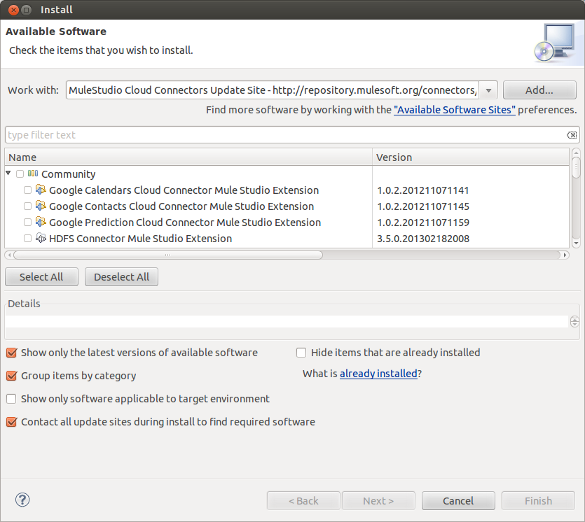
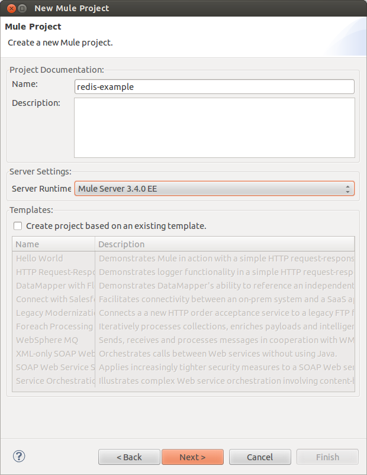
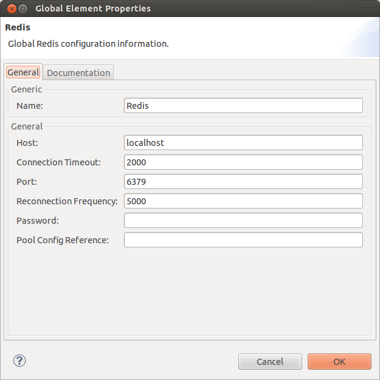
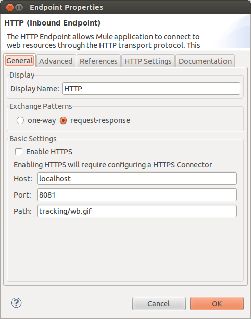
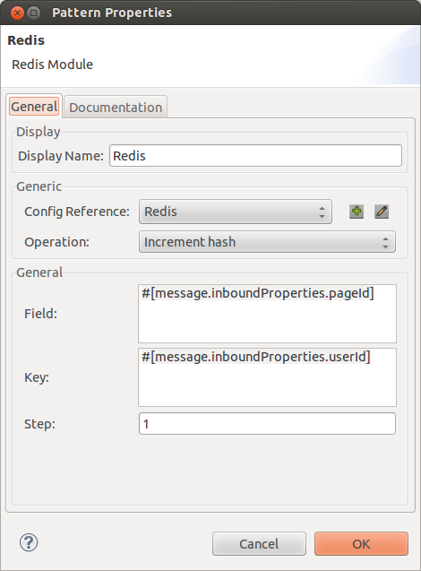
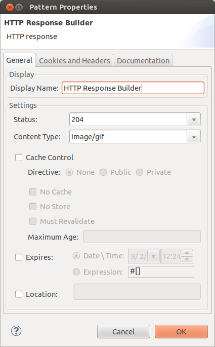

# Mule Sample: Page view analytics

## Purpose

Redis is a data structure server whose values can contain strings, hashes, lists, sets and sorted sets. 
In this example, we will create a simple page view tracker that counts user page views.

## Prerequisites

In order to follow this sample walk-through you'll need:

- A working installation of a stable version of [Redis](http://redis.io/download) (version 2.4 or above),
- A working installation of a recent version of [Mule Studio](http://www.mulesoft.org/download-mule-esb-community-edition).

## Building the sample application

### Getting Mule Studio Ready

The Redis module doesn't come bundled with Mule Studio so we have to install it first.
For this, we have to do the following:

1. Open Mule Studio and from "Help" menu select "Install New Software...". The installation dialog - shown below - opens.
2. From "Work with" drop down, select "MuleStudio Cloud Connectors Update Site". The list of available connectors will be shown to you.
3. Find and select the Redis module in the list of available connectors, the tree structure that is shown below.
A faster way to find a specific connector is to filter the list by typing the name of the connector in the input box above the list.
You can choose more than one connector to be installed at once.
4. When you are done selecting the Redis module, click on "Next" button.
Installation details are shown on the next page.
Click on "Next" button again and accept the terms of the license agreement.
5. Click on "Finish" button. The Redis module is downloaded and installed onto Studio.
You'll need to restart the Studio for the installation to be completed.

### Setting up the project

Now that we've got Mule Studio up and running, it's time to work on the Mule Application.
Create a new Mule Project by clicking on "File > New > Mule Project".
In the new project dialog box, the only thing you are required to enter is the name of the project.
You can click on "Next" to go through the rest of pages.

The first thing to do in our new application is to configure the Redis connector to connect to our local server.

> We assume that you have not added security (password protection) nor changed the default port it listens to.

For this, in the message flow editor, click on "Global Elements" tab on the bottom of the page.
Then click on "Create" button on the top right of the tab.
In the "Choose Global Element" type dialog box that opens select "Redis" under "Cloud Connectors" and click OK.

In the Redis configuration dialog box that follows, set the name to "Redis". 

You are done with the configuration. Click "OK" to close the dialog box.

The XML for the global element should look like this:

    <redis:config name="Redis" doc:name="Redis" />

### Building the web bug service flow

It's time to start building the flow that will:
- accept HTTP GET requests,
- increment a user-specific hit map, keyed by page ID,
- and return an empty GIF response.

Start by dropping an `HTTP` element on the visual editor and configure it as below:

We want to asynchronously increment the map in Redis, so first drop an async scope in the flow, right after the HTTP endpoint.
Then drop a Redis connector element right inside the async scope.
Double-click it and configure it as shown below:

Now let's return an empty HTTP response, with the GIF content type.
Drop an "HTTP Response Builder" in the flow, after the async scope and configure it as shown below:

That's it! Your flow should look very much like this:

### Flow XML

The final flow XML should be similar to this:

    <?xml version="1.0" encoding="UTF-8"?>
    <mule xmlns:http="http://www.mulesoft.org/schema/mule/http" xmlns:redis="http://www.mulesoft.org/schema/mule/redis"
        xmlns="http://www.mulesoft.org/schema/mule/core" xmlns:doc="http://www.mulesoft.org/schema/mule/documentation"
        xmlns:spring="http://www.springframework.org/schema/beans" version="EE-3.4.0"
        xmlns:xsi="http://www.w3.org/2001/XMLSchema-instance"
        xsi:schemaLocation="
            http://www.springframework.org/schema/beans http://www.springframework.org/schema/beans/spring-beans-current.xsd
            http://www.mulesoft.org/schema/mule/core http://www.mulesoft.org/schema/mule/core/current/mule.xsd
            http://www.mulesoft.org/schema/mule/redis http://www.mulesoft.org/schema/mule/redis/3.4/mule-redis.xsd
            http://www.mulesoft.org/schema/mule/http http://www.mulesoft.org/schema/mule/http/current/mule-http.xsd">
    
        <redis:config name="Redis" doc:name="Redis" />
    
        <flow name="redis-exampleFlow1" doc:name="redis-exampleFlow1">
            <http:inbound-endpoint exchange-pattern="request-response"
                host="localhost" port="8081" path="tracking/wb.gif" doc:name="HTTP" />
            <async doc:name="Async">
                <redis:hash-increment config-ref="Redis"
                    field="#[message.inboundProperties.pageId]" key="#[message.inboundProperties.userId]"
                    doc:name="Redis" />
            </async>
            <http:response-builder status="204" contentType="image/gif"
                doc:name="HTTP Response Builder" />
        </flow>
    </mule>

### Testing the application

Now it's time to test the application.
Run the application in Mule Studio using `Run As > Mule Application`.

If you browse `http://localhost:8081/tracking/wb.gif?userId=123456&pageId=ABC` you should get an empty page in the browser.

> You can also embed the following in an HTML page and load this page:
> ``

To see what happened behind the scene, connect to the Redis server with its command line client (`redis-cli`).
Then run:

    redis 127.0.0.1:6379> EXISTS 123456
    (integer) 1

A user-specific hit count map has been created for user ID `123456`.
Now run:

    redis 127.0.0.1:6379> HKEYS 123456
    1) "ABC"

Hits have been recorded for the page ID `ABC`.
Now run:

    redis 127.0.0.1:6379> HGET 123456 ABC
    "1"

The hit count is currently 1.
You should see this count increase as you keep hitting: `http://localhost:8081/tracking/wb.gif?userId=123456&pageId=ABC`

## Other resources

For more information on:

- Redis Connector, please visit http://mulesoft.github.io/redis-connector
- Mule AnyPoint® connectors, please visit http://www.mulesoft.org/extensions
- Mule platform and how to build Mule applications, please visit  http://www.mulesoft.org/documentation/display/current/Home
